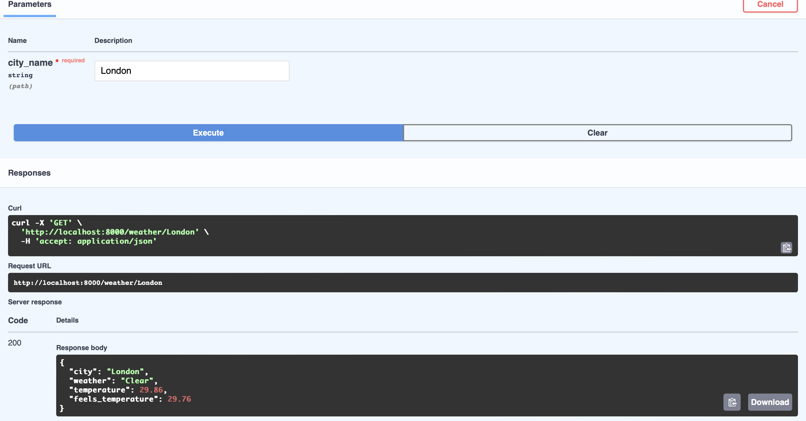

# CityWeather API
FastAPI weather service with Redis caching and graceful error handling 

A caching proxy for OpenWeatherMap API: clean REST interface, Redis-cached responses (TTL 10 min), meaningful error handling instead of raw upstream failures 

## User problem
Common problems when working with external APIs: slow responses, request limits, and unclear error codes when the upstream service fails. This project solves all three: caching reduces latency and saves request quota, and explicit error handling returns comprehensible responses.

{{The most common problems with common API: long time to wait answer, limits for requests, some of them sometimes falls and return incomprehensible error codes. This projects solves it: cache decreases latency of responses and economies limit, error handling return comprehensible responses.}} - С ошибками

## Architecture
```
Client → FastAPI → Redis cache
                       ↓ (miss)
                  OpenWeatherMap API
```


## Technical solutions
I built the FastAPI microservice to interact with the OpenWeatherMap API. During development were made some tech decisions:
- Using FastAPI as a main framework to increase development speed and app compactness, also out-of-the-box asynchrony support.
- Redis for caching API responses to speed up responses for frequently requested cities.
- Using the asynchronous HTTP-requests library httpx for an acceleration responses and an improving user experience working with service
- Using configuration settings (pydantic-settings) to keep sensitive data out of the code: API key; also for ease of containerization (Redis host is externalized via environment variables for local development and containerized deployment)
- Added functional testing with pytest
- Added app containerization (Dockerfile), also launching orchestration (app + Redis service) with docker-compose
- Explicit error mapping: upstream failures translate to meaningful HTTP codes (404 city not found, 502 upstream error, 504 timeout) instead of leaking raw errors

## How to start using
First of all, get your own API key on the https://openweathermap.org. Create settings/.env from settings/.env.example and add your API key.

You can start this app with the following commands:
### Run with Docker (recommended) 
`docker-compose up --build`
### Run locally 
`pip install -r requirements.txt`
`uvicorn main:app --reload`

## How to start testing
Tests run fully offline: external API is mocked via respx, Redis via fakeredis
`pytest`

## Technology stack:
- FastAPI - async framework
- Redis - cache responses
- httpx - async requests library 
- pydantic-settings - configuration management, flexibility with own configs
- pytest - testing
- Docker - containerization

## Example of request
```
curl http://localhost:8000/weather/London

{"city": "London", "weather": "Clear", "temperature": 29.86, "feels_temperature": 29.76}
```

Screenshot from Swagger:

